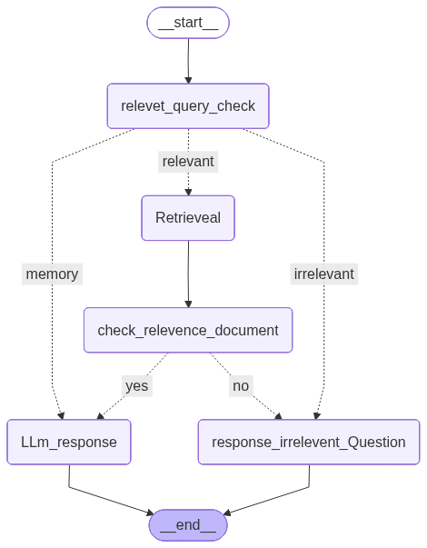

# Lawyer_chatbot

[](https://www.python.org/)  
[]  
[](./LICENSE)

## Overview

**Lawyer_chatbot** is a domain-specific Retrieval-Augmented Generation (RAG) chatbot focused on constitutional law and human rights. It combines a document store of legal texts with a vector search + LLM pipeline to provide context-grounded answers to user queries.

> **Purpose:** provide fast, traceable answers grounded in the project’s constitutional and rights databases to assist legal research and accessibility of legal content — **not** a substitute for professional legal advice.

---

## Features

- Ingest legal documents (constitution, case law, statutes, policies)
- Build vector embeddings and searchable knowledge base
- Answer user questions using RAG (retrieval + LLM) pattern
- Persisted chat history for session continuity (`chat_history.db`)
- Workflow visualization included (`workflow_graph.png`)

---


## Architecture



--

## Repository Structure

```

├── Data/                 # Raw documents / datasets (constitution, right_and_law)
├── constitution_db/      # Domain corpus (place your files here)
├── Right_and_law_db/     # Additional legal database
├── src/                  # Core source code (ingest, vector build, server, utils)
├── Requirements.txt      # Python dependencies
├── workflow_graph.png    # Architecture / pipeline diagram
├── chat_history.db       # Persisted chat history (SQLite)
├── checkpoints.db        # Persistent store / checkpoints
└── README.md

````


## Quickstart (Local Development)

### 1. Prerequisites
- Python 3.10+ (recommended)
- Git
- (Optional) CUDA-enabled GPU for local LLM inference
- API keys for external LLM providers (e.g., OpenAI, Anthropic)

### 2. Clone & Setup
```bash
git clone https://github.com/ArProvat/Lawyer_chatbot.git
cd Lawyer_chatbot

# Create virtualenv (Unix/macOS)
python -m venv venv
source venv/bin/activate

# On Windows (PowerShell)
# python -m venv venv
# venv\Scripts\Activate.ps1

pip install --upgrade pip
pip install -r Requirements.txt
````

### 3. Configuration

Create a `.env` file (or export environment variables):

```env
# LLM provider (OpenAI, Anthropic, etc.)
OPENAI_API_KEY=your_openai_api_key_here
OR
HUGGINGFACE_API_KEY=your_huggingface_api_key_here

# Embedding/LLM config (optional)
EMBEDDING_MODEL=your_embedding_model_name
LLM_MODEL=your_llm_model_name

# Vector DB / paths
VECTOR_STORE_PATH=./checkpoints.db

# Other toggles
MAX_CONTEXT_TOKENS=1500
```

> If your project uses a different provider or local LLM, set the appropriate environment variable keys used in `src/`.

### 4. Ingest / Build Vector Store

Replace the script name with the actual ingestion script in `src/`:

```bash
# Example
python src/ingest.py \
  --input_dir "./constitution_db" \
  --output_store "./checkpoints.db" \
  --chunk_size 1000 \
  --chunk_overlap 200
```

This step will:

* Parse documents (`.txt` / `.pdf`)
* Chunk text into passages
* Produce embeddings and persist a vector index

### 5. Run the Chat Server

Replace with your actual server script:

```bash
# Example
python src/workflow.py
# or
streamlit run src/Streamlit_ui.py
```


## Credits

* Project owner: **ArProvat** ([linkedin link](www.linkedin.com/in/md-abdurrahman770))
* Inspired by RAG best practices

---

## Contact

For questions or collaboration: open an **issue** or contact via GitHub profile.

```
```


